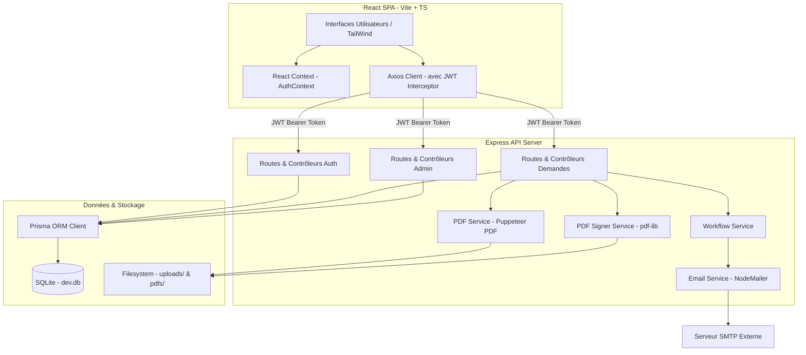

# Architecture Technique du Portail ERP MCT IT

Ce document décrit en détail l'architecture logicielle, le modèle de données, le fonctionnement du moteur de workflow et la sécurité du portail ERP MCT IT (MCT IT Portal).

---

## 1. Vue d'Ensemble & Diagramme d'Architecture

Le portail ERP MCT IT est une application web moderne de gestion de formulaires et de workflows de validation de demandes internes. Il repose sur une architecture découplée avec une API REST en Node.js/Express, un client riche Single Page Application (SPA) en React/TypeScript, et une base de données relationnelle SQLite pilotée par Prisma.

---

## 2. Modèle de Données & Base de Données

Le stockage s'appuie sur une base **SQLite** avec le client **Prisma ORM** pour assurer l'intégrité référentielle et la portabilité du code.

### Schéma des Tables (Prisma Model)
*   **`Department`** : Gère la configuration des départements de la société, le rattachement aux directions (DGOF, DO, MBD, DSC, DFM, DAF) et stocke les informations dynamiques des valideurs N+1 (`chefEmail`/`chefName`) et N+2 (`directorEmail`/`directorName`).
*   **`User`** : Contient l'identité des comptes utilisateurs (matricule, fonction, email, mot de passe hashé via bcrypt), leur statut de validation d'adresse email (`emailVerified`) et leur rôle au sein du système (ex: `EMPLOYEE`, `IT`, `IT_ADMIN`, `MOYENS_GENERAUX`, `ADMIN`).
*   **`Request`** : Entité centrale des demandes. Elle utilise une architecture flexible où les données de formulaires spécifiques à chaque type de document sont stockées sous forme d'une chaîne sérialisée JSON à plat dans le champ **`formData`**. Elle contient également des colonnes spécifiques pour les mémo d'attribution de matériels (Moyens Généraux) et le suivi des règlements financiers (Trésorerie).
*   **`Validation`** : Journalise l'historique d'audit des approbations et rejets de chaque dossier. Chaque validation enregistre le valideur, le statut appliqué, la date précise et le commentaire associé.
*   **`EmailLog`** : Enregistre l'ensemble des courriels de notifications de validation envoyés pour assurer un suivi opérationnel fiable.

---

## 3. Architecture du Backend

Le backend est structuré de manière modulaire selon les standards du développement Express :

### A. Routes et Middleware de Sécurité
*   **`auth.routes.js`** : Gère l'enregistrement, la connexion, le profil utilisateur et la vérification des comptes par code à 6 chiffres transmis par e-mail.
*   **`requests.routes.js`** : Enregistre les endpoints de soumission, de modification (`PUT`), de validation (`POST /:id/validate`), de clôture et d'annulation par le demandeur (`POST /:id/cancel`).
*   **Middleware d'authentification (`auth.js`)** : Intercepte les en-têtes `Authorization: Bearer <JWT>`, valide la signature et injecte l'utilisateur courant dans `req.user`.
*   **Middleware de Rôle (RBAC)** : Valide les autorisations d'accès selon les rôles utilisateurs requis (ex: `requireRole(['IT', 'ADMIN'])`).
*   **Protection Path Traversal** : Utilise l'utilitaire `getSafePath` pour valider que tous les téléchargements et prévisualisations de fichiers se cantonnent strictement aux sous-répertoires autorisés.

### B. Contrôleurs Clés
*   **`request.controller.js`** :
    *   `createRequest` : Valide la saisie, génère une référence unique basée sur le format réglementaire et lance la première étape de validation.
    *   `updateRequest` : Permet la modification sécurisée de la demande par son auteur si elle n'est pas encore fermée.
    *   `cancelRequest` : Permet l'annulation immédiate par l'auteur, faisant passer le statut à `REJECTED` en insérant une trace d'audit.
    *   `validateRequest` : Réalise les transitions d'état du workflow, enregistre les validations et génère/met à jour la fiche PDF signée à chaque approbation.

### C. Services Métier
1.  **`workflow.service.js` (Moteur de Workflow)** :
    Résout de manière dynamique la liste des étapes de validation en fonction du type de document et du département du demandeur. Il vérifie l'absence de doublons (par exemple, si le chef est aussi le directeur de la direction) et attribue l'e-mail du valideur courant au dossier (`nextValidatorEmail`).
2.  **`email.service.js` (Notifications)** :
    Standardise et envoie les courriels de notification de validation ou de clôture à l'aide de templates HTML structurés pour chaque profil (Demandeur, Responsable IT, Moyens Généraux, Trésorerie).
3.  **`pdf.service.js` (Génération PDF SMQ)** :
    Génère des fiches de demandes formatées selon le Système de Management de la Qualité (SMQ) de MCT. Il lance une instance headless de **Puppeteer** pour convertir des templates HTML en fichiers PDF A4 à haute fidélité visuelle.
4.  **`pdf-signer.service.js` (Signature Électronique)** :
    Intervient après chaque validation. Il utilise la bibliothèque **`pdf-lib`** pour ouvrir le fichier PDF généré et dessiner visuellement les tampons et signatures d'approbation numériques dans les cases dédiées, assurant une conformité visuelle absolue sans nécessiter de papier.

---

## 4. Architecture du Frontend

Le frontend est une application moderne Single Page Application (SPA) bâtie avec **React**, **TypeScript** et **Vite**.

### A. Gestion d'État et Sécurité
*   **`AuthContext.tsx`** : Conserve l'état de connexion de l'utilisateur, charge son profil au démarrage de l'application, stocke le token JWT dans le stockage local (`localStorage`) et redirige automatiquement les utilisateurs non connectés.
*   **Axios Client (`api.ts`)** : Fournit une instance pré-configurée d'Axios qui intercepte chaque requête sortante pour y inclure l'en-tête de sécurité JWT Bearer.

### B. Pages et Interfaces Spécialisées
*   **`DashboardPage.tsx` (Tableau de Bord Standard)** : Affiche les indicateurs clés de performance (KPI) du demandeur, des raccourcis d'actions rapides et une liste paginée de demandes réparties par onglets (Mes demandes, Demandes en attente de ma validation, Historique).
*   **`TreasuryDashboardPage.tsx` (Trésorerie)** : Tableau de bord spécialisé listant uniquement les demandes nécessitant un décaissement (ex: Bons de caisse `ENR.RF.002`), permettant la validation des règlements financiers.
*   **`MoyensGenerauxDashboardPage.tsx` (Moyens Généraux)** : Permet de suivre et piloter la livraison des articles d'approvisionnement (`ENR.GA.003`), d'attribuer les matériels et de finaliser la clôture.
*   **`NewRequestPage.tsx` & `RequestDetailPage.tsx`** : Pages interactives pour la création, l'édition dynamique et la consultation détaillée de demandes avec prévisualisation PDF intégrée et gestion dynamique des liaisons multiples d'actifs.

---

## 5. Logique des Circuits de Validation par Type de Fiche

Voici le détail des chemins de validation résolus dynamiquement par le système :

| Type de Fiche | Code Interne | Circuit de Validation |
| :--- | :--- | :--- |
| **Demande de Matériel / Actif** | `ENR_SI_008` | Demandeur ➔ Chef de Service (N+1) ➔ Directeur Département (N+2) ➔ DGOF ➔ DG ➔ Responsable IT (Validation finale et attribution) |
| **Demande d'Habilitation** | `ENR_SI_005` | Demandeur ➔ Chef de Service (N+1) ➔ Ressources Humaines (RH) ➔ Directeur Département (N+2) ➔ DGOF ➔ DG ➔ Service Informatique (IT) |
| **Demande d'Approvisionnement Caisse** | `ENR_SI_006` | Demandeur ➔ Chef de Service (N+1) ➔ Directeur Financier (DAF) ➔ Trésorerie (Règlement) ➔ Service Informatique (IT) |
| **Bon de Caisse** | `ENR_RF_002` | Demandeur ➔ Chef de Service (N+1) ➔ Directeur Département (N+2) ➔ DGOF ➔ DG ➔ Trésorerie (Paiement) |
| **Demande d'Approvisionnement** | `ENR_GA_003` | Demandeur ➔ Responsable IT ➔ Moyens Généraux (Validation et Clôture finale sans trésorerie) |
| **Autre Demande** | `AUTRE` | Demandeur ➔ Chef de Service (N+1) ➔ Directeur Département (N+2) ➔ DGOF ➔ DG ➔ Trésorerie ➔ Service Informatique (IT) |

---

## 6. Bonnes Pratiques & Sécurité Implémentées

Le système inclut plusieurs barrières de protection indispensables pour un environnement d'entreprise :
1.  **Vérification de compte double-facteur (Email)** : Obligation de valider son compte avec le jeton reçu par email avant de pouvoir interagir avec le système.
2.  **Prévention contre le Path Traversal** : Vérification stricte des requêtes de fichiers avec blocage systématique de tout chemin contenant des marqueurs de remontée (`..`).
3.  **Gestion propre de la saisie numérique (React)** : Conservation des types `string` lors de la saisie dans l'état local du formulaire pour éliminer les réinitialisations ou sauts de curseur clavier pendant la frappe, et conversion différée uniquement lors des calculs financiers et de la validation finale du schéma de données.
4.  **Liaison dynamique d'actifs multiples** : La structure permet de lier plusieurs demandes d'actifs validées à une seule demande d'approvisionnement, créant des badges de navigation directs entre les documents liés pour faciliter le travail d'audit du valideur final.
